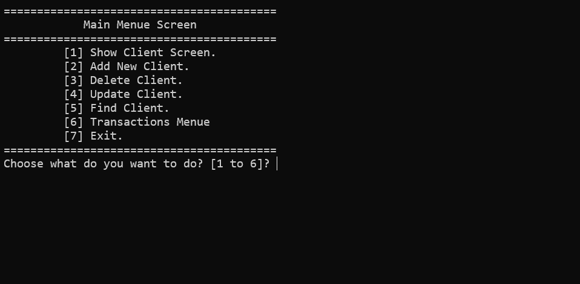
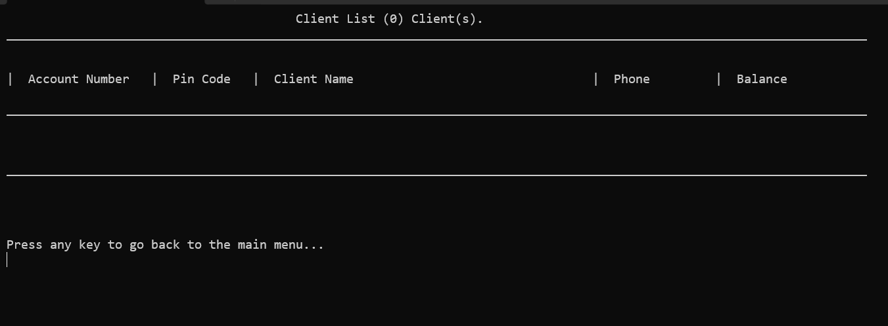
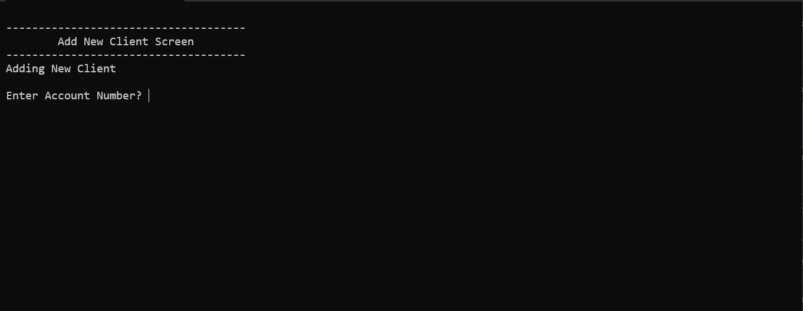
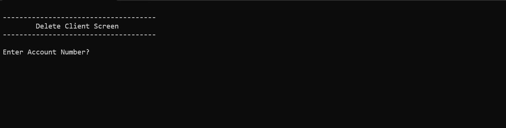
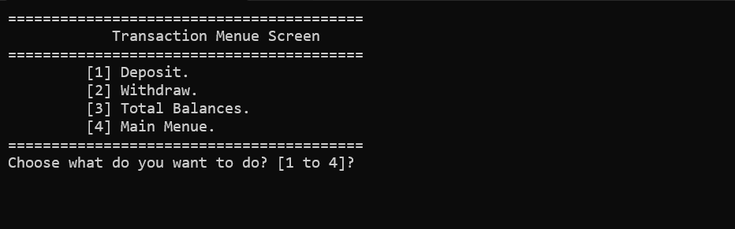
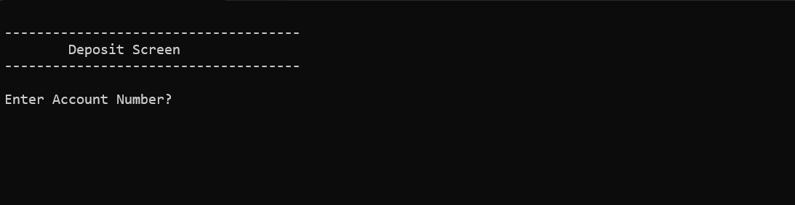
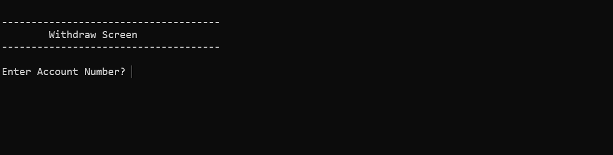
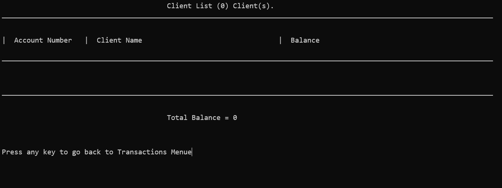

# 🏦 Bank Management System (C++ - Functional Programming Extension)

An extended command-line Bank Management System built in C++ using **Functional Programming (FP)** concepts. This version expands on core CRUD operations by adding a dedicated **Transactions Sub-Menu** capable of processing deposits, withdrawals, and calculating total bank assets.

---

## ⚠️ IMPORTANT REQUIREMENTS BEFORE RUNNING

> 🚨 **Prerequisite File Setup:**  
> Before running the executable, ensure that a text file named **`Clients.txt`** and the custom header **`MyLibs.h`** are placed in the same directory as the project.
> 
> ### File Format & Delimiter
> Client records inside **`Clients.txt`** are stored line-by-line using **`#//#`** as a custom field delimiter:
> 
> ```text
> AccountNumber#//#PinCode#//#Name#//#Phone#//#AccountBalance
> ```
> 
> **Sample `Clients.txt` data:**
> ```text
> A101#//#1234#//#John Doe#//#0501234567#//#5000.000000
> A102#//#4321#//#Alice Smith#//#0507654321#//#8500.500000
> ```

---

## 📸 Screenshots

### 1. Main Menu Screen


### 2. Client List View


### 3. Add New Client Screen


### 4. Delete Client Screen


### 5. Update Client Screen


### 6. Search / Find Client Screen


### 7. Transactions Menu


### 8. Deposit Screen


### 9. Withdraw Screen


### 10. Total Balances List


---

## ✨ Features & Architecture

### 1. Main Client Management (CRUD)
* **Show Client List:** Displays formatted tabular details of all registered bank clients.
* **Add New Client:** Validates unique account numbers prior to saving to prevent duplicates.
* **Delete Client:** Safe soft-delete mechanism with confirmation prompts and automated file synchronization.
* **Update Client:** Edit existing client fields (PIN Code, Name, Phone Number, Balance).
* **Find Client:** Instant client lookup by Account Number.

### 2. Transactions Sub-Menu (Extension Features)
* **Deposit:** Add funds to any valid account and automatically update `Clients.txt`.
* **Withdraw:** Process withdrawals with built-in checks preventing overdrafts exceeding client balances.
* **Total Balances:** Displays account balance summaries alongside an aggregated sum of total bank assets.

---

## 🛠️ Technical Specifications

* **Language:** C++
* **Paradigm:** Procedural / Functional Programming (`struct`, pass-by-reference vectors, enums)
* **File Operations:** Stream processing with `fstream`
* **Helper Libraries:** Custom `MyStringLib::vSplitString` in `MyLib.h` for custom delimiter parsing
* **Console UI Formatting:** Tabular alignment using `std::setw` and input handling (`cin.clear()`)

---

## 🚀 How to Run

### Option 1: Using Visual Studio
1. Ensure **`Clients.txt`** and **`MyLibs.h`** are placed in the project root folder.
2. Open the solution file in Visual Studio.
3. Press `Ctrl + F5` to compile and launch.

### Option 2: Using Terminal
1. Navigate to the project folder in terminal.
2. Compile the source file:
   ```bash
   g++ "Bank Project Course 7 FP Extension.cpp" -o BankSystemExt.exe
